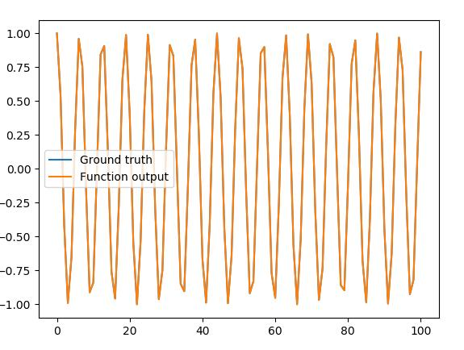
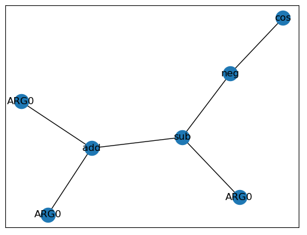
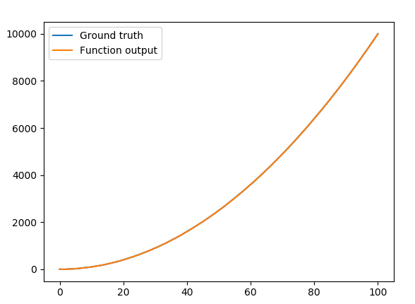
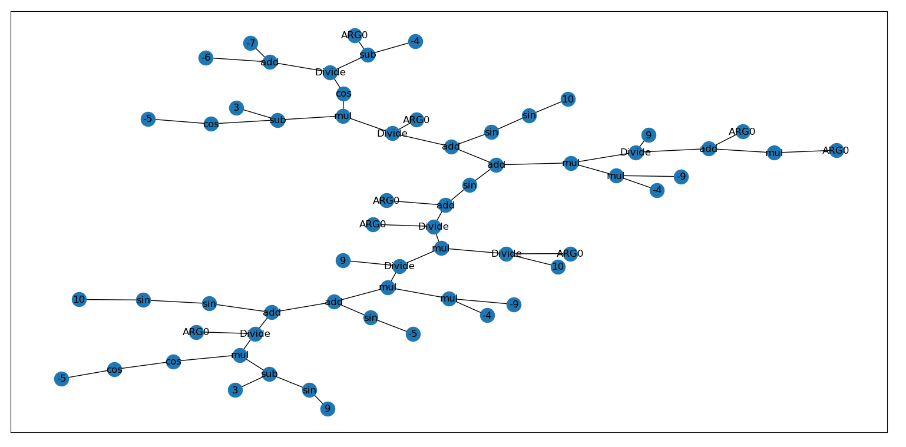

# Time Series Prediction using Genetic Programming

# Dependencies
- DEAP
- NetworkX
- Numpy
- Matplotlib

# How to run
```sh
$ python main.py -population [population size] -iterations [number of iterations] -data [data path]
```

# Examples
## Sine wave
```sh
$ python main.py -population 200 -iterations 200 -data example_data/cos_data.csv
```

## Resulting fit
<br />

## Resulting graph
<br />

<br/>

## X Squared with added noise
```sh
$ python main.py -population 200 -iterations 200 -data example_data/sqr_noisy_data.csv
```

## Resulting fit
<br />

## Resulting graph
<br />